  <picture>
    <source media="(prefers-color-scheme: dark)" srcset="./dark2.svg">
    <source media="(prefers-color-scheme: light)" srcset="./light2.svg">
    
  </picture>

 

  
  &nbsp;&nbsp;&nbsp;
  
  &nbsp;&nbsp;&nbsp;
  

